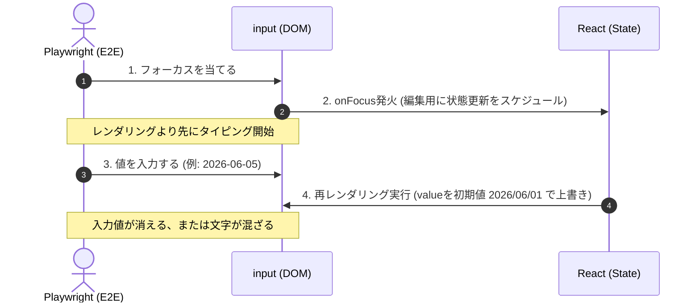

# E2Eテストおよび状態同期に関する設計ガイドライン

このドキュメントは、WBSアウトライナーおよびガントチャートの開発において遭遇した、**「Reactの非同期描画（状態同期）」と「E2Eテスト（Playwright）のタイミング競合」**、および**「Overlay UIにおけるポインターイベント制御」**に関する知見と、それを解決するための設計デザインパターンをまとめたものです。

---

## 1. React制御コンポーネント ↔ E2Eテストの入力競合と解決策

### 課題
入力フィールド（例: 日付セル）において、フォーカス時（編集用 `YYYY/MM/DD`）と非フォーカス時（表示用 `MM/DD`）で表示フォーマットを切り替える設計を行った際、Playwrightの `fill()` 操作が値の書き換え中にキャンセルされたり、古い値と新しい値が合成（例: `2026/06/012026-06-05`）されてパースエラーになる現象が発生した。

### 原因
Reactの `useState` の状態更新および再描画は**非同期（バッチ処理）**で行われる。
1. Playwrightが要素をフォーカスする。
2. 要素のフォーカスに伴い Reactの `onFocus` や `useEffect` が走り、状態（`localStart`）を編集用に更新して再描画をスケジュールする。
3. Reactの再レンダリングが完了する前に、Playwrightが超高速でタイピング（`fill`）を開始する。
4. タイピングの途中で Reactの再レンダリング（`value={localStart}`）が走り、Playwrightの入力内容が古い初期値で上書き（消去）されてしまう。



### 解決策（同期フォーカス制御パターン）
フォーカス時の表示形式の切り替えを、非同期な `useEffect` に依存せず、ブラウザイベントである **`onFocus` ハンドラー内で同期的に状態更新を実行する** ように設計する。これにより、Playwrightがタイピングを開始する前に入力欄の `value` が編集用形式に確実に切り替わり、上書きが発生しなくなる。

また、`useEffect` は**非フォーカス（blur）の時だけ**ストアの値の同期を実行するように役割を完全に分離する。

#### 実装パターン
```tsx
// 1. 同期的なフォーカス時ハンドラー
onFocus={() => {
  if (isReadOnly) return;
  const editVal = formatToEdit(startValue);
  setLocalStart(editVal);             // 同期的にローカル状態に値をセット
  localStartRef.current = editVal;    // refにも即座に反映
  setFocusedTaskCell(taskId, 'startDate');
}}

// 2. 非フォーカス時のみ動作する同期useEffect
useEffect(() => {
  if (!isFocusedStart) {
    const showVal = formatToShow(startValue);
    setLocalStart(showVal);
    localStartRef.current = showVal;
  }
}, [isFocusedStart, startValue]);
```

---

## 2. Overlay Span設計とポインターイベント制御

### 課題
非フォーカス時に `MM/DD` 形式のテキストを表示するため、`<input>` 要素の上に `<span>`（Overlay）を絶対配置（`absolute inset-0`）で重ねる設計（Overlay Spanパターン）を導入した際、Playwrightが `input` 要素を検出できず `pointer-events-none` クラスが原因でクリックや入力をタイムアウトさせてしまう現象が発生した。

### 原因
非フォーカス時の `input` 要素自体に `pointer-events-none` を付与してしまうと、Playwrightの要素解析においてその要素が「クリック不可」とみなされる。
また、重ねている `span` が `input` を覆っていると、Playwrightは `input` が別の要素に隠されている（intercepts pointer events）と判断して操作をブロックする。

### 解決策
1. **`span` にのみ `pointer-events-none` を付与する**: 
   上に重なる `span` をクリック透過にすることで、ユーザーやPlaywrightのクリックイベントは常に下にある `input` に到達する。
2. **`input` の `pointer-events-none` は解除し、CSSで文字だけ隠す**:
   非フォーカス時の `input` に `pointer-events-none` を付けるのではなく、単に `text-transparent`（文字透明）および `caret-transparent`（カーソル非表示）を適用する。これにより、`input` は依然としてマウスクリックやフォーカスイベントを直接受け取ることができる状態で、見かけ上だけ `span` のテキストが透けて見える状態を作ることができる。

```html
<div className="relative w-20 h-full flex items-center justify-center">
  {/* 1. 上に重ねる表示用スパン（クリック透過） */}
  {!isFocused && (
    <span className="absolute inset-0 pointer-events-none select-none">
      06/10
    </span>
  )}

  {/* 2. 実体としての入力欄（非フォーカス時は文字のみ透明化し、クリックは有効に保つ） */}
  <input
    type="text"
    value={localStart}
    className={clsx(
      "bg-transparent outline-none w-20 text-center",
      !isFocused && "text-transparent caret-transparent"
    )}
  />
</div>
```

---

## 3. Playwrightにおけるタイムラインドラッグ＆ドロップの安定化

### 課題
ガントチャート上でタスク間の依存線を引くテスト（ドラッグ＆ドロップ操作）を行う際、マウスの移動や `mouseup`（ドロップ）が空振りし、依存関係が正しく確立されずにテストが落ちる。

### 原因
1. **ビューポート幅の制限**:
   Playwrightのデフォルトの画面幅（1280px）よりも右側（例えば `x: 1361` などの未来の日付の位置）にドラッグ先のガントバーがある場合、マウスが画面端で引っかかって目標に到達できない。
2. **横スクロールコンテナ**:
   ガントチャートが個別のスクロール領域（`overflow-auto`）になっている場合、Playwrightの要素スクロールが正しくトリガーされないことがある。
3. **mouseup時の当たり判定不足**:
   依存関係の接続判定（`e.target`）が、ガントバー自体の小さな矩形領域（`bg-blue-100` などのdiv）の真上で正確に離された場合のみしか検知されないため、わずかな座標のズレで失敗する。

### 解決策
- **テストのビューポートサイズを拡張する**:
  テストの冒頭で十分な画面幅（例: `1600px` 以上）を確保し、ドラッグ対象が画面内にスクロールなしで収まるようにする。
  ```tsx
  await page.setViewportSize({ width: 1600, height: 900 });
  ```
- **明示的なスクロールとウェイト**:
  ドラッグする前に、ドラッグ先（および元）のバーを `scrollIntoViewIfNeeded()` で強制的に可視化し、クリック後に短いウェイト（`page.waitForTimeout(100)`）を置いてブラウザの描画を落ち着かせてからドラッグを開始する。
- **行コンテナへのID付与（当たり判定の拡張）**:
  `GanttTimelineRow.tsx` の最外殻ラッパー（行全体）に `data-task-id={taskId}` を付与する。
  これにより、ドラッグ接続の `mouseup` イベントが発生した際、ガントバーのピンポイントな真上でなくても、その行のタイムライン上のどこかであれば親を辿って（イベントバブリング）確実に接続先タスクIDを特定できるようになり、ドラッグの当たり判定が飛躍的に堅牢になる。
  ```tsx
  // useGanttDrag.ts での当たり判定検出コード
  if (currentDragState.mode === 'dependency') {
    let target = e.target as HTMLElement;
    while (target && !target.getAttribute?.('data-task-id')) {
      target = target.parentElement as HTMLElement;
    }
    // 最外殻の行ラッパーが data-task-id を持っているため、必ずヒットする！
  }
  ```
